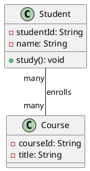

# บทที่ 6: Class Diagram พื้นฐาน

## Learning Outcomes (ผลลัพธ์การเรียนรู้)

หลังจากเรียนจบบทนี้ นักเรียนจะสามารถ:
1. อธิบายความหมายและความสำคัญของ Class Diagram ได้
2. อ่านและเข้าใจสัญลักษณ์ต่างๆ ใน Class Diagram ได้
3. สร้าง Class Diagram พื้นฐานได้
4. แสดง Relationships ระหว่าง Classes (Association, Inheritance, Composition) ได้
5. แปลง Class Diagram เป็น Java Code และในทางกลับกันได้

## 1. ความหมายของ Class Diagram

**Class Diagram** คือแผนภาพที่แสดง:
- **โครงสร้างของ Classes** ในระบบ
- **Attributes** และ **Methods** ของแต่ละ Class
- **ความสัมพันธ์** (Relationships) ระหว่าง Classes

### ประโยชน์

- **การสื่อสาร**: แสดงโครงสร้างระบบให้เข้าใจง่าย
- **การออกแบบ**: วางแผนก่อนเขียนโค้ด
- **Documentation**: เอกสารประกอบระบบ
- **การวิเคราะห์**: เข้าใจระบบที่มีอยู่

## 2. สัญลักษณ์พื้นฐาน

### 2.1 Class

```
┌─────────────────────┐
│      ClassName      │  ← ชื่อ Class
├─────────────────────┤
│ - attribute1: Type  │  ← Attributes (Fields)
│ + attribute2: Type  │
├─────────────────────┤
│ + method1(): void   │  ← Methods
│ - method2(): Type   │
└─────────────────────┘
```

### 2.2 Access Modifiers

```
+  public      (เข้าถึงได้จากทุกที่)
-  private     (เข้าถึงได้ใน Class เท่านั้น)
#  protected   (เข้าถึงได้จาก Class และ Subclass)
~  default     (เข้าถึงได้ใน Package เดียวกัน)
```

### ตัวอย่าง Class

```
┌─────────────────────────────┐
│         Student             │
├─────────────────────────────┤
│ - studentId: String         │
│ - name: String              │
│ - gpa: double               │
├─────────────────────────────┤
│ + getStudentId(): String    │
│ + setName(name: String)     │
│ + calculateGrade(): String  │
└─────────────────────────────┘
```

**แปลเป็น Java Code:**

```java
public class Student {
    private String studentId;
    private String name;
    private double gpa;
    
    public String getStudentId() {
        return studentId;
    }
    
    public void setName(String name) {
        this.name = name;
    }
    
    public String calculateGrade() {
        // implementation
    }
}
```

## 3. Relationships (ความสัมพันธ์)

### 3.1 Association (ความสัมพันธ์ทั่วไป)

แสดงว่า Class หนึ่ง**ใช้งาน**หรือ**เกี่ยวข้อง**กับ Class อื่น

```
┌─────────┐            ┌─────────┐
│ Student ├────────────┤ Course  │
└─────────┘            └─────────┘
```

**Java Code:**

```java
class Student {
    private Course course;  // Student เกี่ยวข้องกับ Course
}
```

### 3.2 Multiplicity (จำนวนความสัมพันธ์)

```
┌─────────┐      1      ┌─────────┐
│ Teacher ├─────────────┤ Course  │
└─────────┘             └─────────┘

┌─────────┐      *      ┌─────────┐
│ Student ├─────────────┤ Course  │
└─────────┘             └─────────┘

Symbols:
1      = เท่ากับ 1
0..1   = 0 หรือ 1
*      = 0 หรือมากกว่า
1..*   = 1 หรือมากกว่า
5..10  = ระหว่าง 5 ถึง 10
```

**ตัวอย่าง:**

```
┌─────────┐    1     *  ┌─────────┐
│ Teacher ├────────────┤ Student │
└─────────┘  teaches   └─────────┘
```

- 1 Teacher สอนได้หลาย (*) Students
- * Students เรียนกับ 1 Teacher

### 3.3 Inheritance (Generalization)

แสดง **IS-A relationship** (Subclass สืบทอด Superclass)

```
       ┌─────────┐
       │ Animal  │
       └────┬────┘
            │
            △ (ลูกศรสามเหลี่ยม ชี้ไป Superclass)
            │
     ┌──────┴──────┐
     │             │
┌────┴────┐   ┌────┴────┐
│   Dog   │   │   Cat   │
└─────────┘   └─────────┘
```

**Java Code:**

```java
class Animal { }
class Dog extends Animal { }
class Cat extends Animal { }
```

### 3.4 Composition (ความเป็นส่วนหนึ่ง - แข็งแกร่ง)

แสดงว่า Class หนึ่ง**ประกอบด้วย** Class อื่น และ**ไม่สามารถอยู่ได้โดยไม่มี**กัน

```
┌─────────┐  ◆────────  ┌─────────┐
│   Car   │             │ Engine  │
└─────────┘             └─────────┘
```

- **◆ (Filled Diamond)** = Composition
- Engine เป็นส่วนหนึ่งของ Car
- ถ้า Car ถูกทำลาย Engine ก็ถูกทำลายด้วย

**Java Code:**

```java
class Car {
    private Engine engine;  // Car มี Engine
    
    public Car() {
        this.engine = new Engine();  // สร้างพร้อมกัน
    }
}
```

### 3.5 Aggregation (ความเป็นส่วนหนึ่ง - อ่อนแอ)

แสดงว่า Class หนึ่ง**ประกอบด้วย** Class อื่น แต่**สามารถอยู่ได้แยกกัน**

```
┌────────────┐  ◇────────  ┌─────────┐
│ Department │             │ Teacher │
└────────────┘             └─────────┘
```

- **◇ (Empty Diamond)** = Aggregation
- Department มี Teachers
- ถ้า Department ถูกลบ Teachers ยังอยู่ได้

**Java Code:**

```java
class Department {
    private List<Teacher> teachers;  // มี Teachers
    
    public void addTeacher(Teacher teacher) {
        teachers.add(teacher);  // Teacher มีอยู่แล้ว
    }
}
```

## 4. ตัวอย่าง Class Diagram สมบูรณ์

### ระบบห้องสมุด (Library System)

```
                 ┌─────────────────┐
                 │     Person      │
                 ├─────────────────┤
                 │ - name: String  │
                 │ - id: String    │
                 ├─────────────────┤
                 │ + getName()     │
                 │ + setName()     │
                 └────────┬────────┘
                          △
                          │
              ┌───────────┴───────────┐
              │                       │
    ┌─────────┴─────────┐   ┌────────┴────────┐
    │      Member       │   │    Librarian    │
    ├───────────────────┤   ├─────────────────┤
    │ - memberCard: int │   │ - employeeId    │
    ├───────────────────┤   ├─────────────────┤
    │ + borrowBook()    │   │ + addBook()     │
    │ + returnBook()    │   │ + removeBook()  │
    └──────┬────────────┘   └─────────────────┘
           │
           │ * borrows *
           │
    ┌──────┴────────┐
    │     Book      │
    ├───────────────┤
    │ - isbn: String│
    │ - title       │
    │ - author      │
    ├───────────────┤
    │ + getInfo()   │
    └───────────────┘
```

## 5. การแปลงระหว่าง Class Diagram และ Java Code

### จาก Class Diagram เป็น Java Code

**Class Diagram:**
```
┌──────────────────────┐
│      BankAccount     │
├──────────────────────┤
│ - accountNumber: int │
│ - balance: double    │
├──────────────────────┤
│ + deposit(amount)    │
│ + withdraw(amount)   │
│ + getBalance()       │
└──────────────────────┘
```

**Java Code:**
```java
public class BankAccount {
    private int accountNumber;
    private double balance;
    
    public void deposit(double amount) {
        // implementation
    }
    
    public void withdraw(double amount) {
        // implementation
    }
    
    public double getBalance() {
        return balance;
    }
}
```

### จาก Java Code เป็น Class Diagram

**Java Code:**
```java
public class Rectangle {
    private double width;
    private double height;
    
    public double calculateArea() {
        return width * height;
    }
    
    public double calculatePerimeter() {
        return 2 * (width + height);
    }
}
```

**Class Diagram:**
```
┌──────────────────────────────┐
│        Rectangle             │
├──────────────────────────────┤
│ - width: double              │
│ - height: double             │
├──────────────────────────────┤
│ + calculateArea(): double    │
│ + calculatePerimeter(): double│
└──────────────────────────────┘
```

## 6. ตัวอย่างการใช้งานจริง

ดูตัวอย่างโค้ด Java ที่สมบูรณ์: [ClassDiagramExample.java](../examples/ClassDiagramExample.java)

### สิ่งที่จะเห็นในตัวอย่าง:

1. **การสร้าง Classes ตาม Class Diagram**
2. **การแสดง Relationships ต่างๆ**
3. **การแปลง Class Diagram เป็น Java Code**
4. **ตัวอย่างระบบร้านค้าออนไลน์แบบสมบูรณ์**

## 7. เครื่องมือสำหรับสร้าง Class Diagram

### เครื่องมือฟรี

1. **Draw.io (diagrams.net)** - ออนไลน์, ฟรี
2. **PlantUML** - สร้างจาก Text
3. **Lucidchart** - ออนไลน์ (Free tier)
4. **StarUML** - Desktop application
5. **Visual Paradigm Online** - ออนไลน์ (Free edition)

### PlantUML ตัวอย่าง



## 8. Best Practices

### 8.1 ความชัดเจน
- ใช้ชื่อที่สื่อความหมาย
- ไม่แสดงรายละเอียดมากเกินไป

### 8.2 ความสม่ำเสมอ
- ใช้ Naming Convention เดียวกัน
- จัดวาง Layout อย่างเป็นระเบียบ

### 8.3 ระดับของรายละเอียด
- Conceptual: แสดงแค่ชื่อ Class และ Relationships
- Specification: แสดง Attributes และ Methods หลัก
- Implementation: แสดงทุกรายละเอียด

## 9. ข้อควรระวัง

### 9.1 ไม่ควรแสดงทุกอย่าง
- แสดงเฉพาะสิ่งที่สำคัญ
- Getters/Setters อาจไม่ต้องแสดง

### 9.2 อัพเดทให้ตรงกับโค้ด
- Diagram ควรสอดคล้องกับ Implementation
- อัพเดทเมื่อโค้ดเปลี่ยน

### 9.3 ใช้ Relationships ที่ถูกต้อง
- เลือก Relationship ที่เหมาะสม
- ไม่ใช้ Composition เมื่อควรเป็น Association

## สรุป

- **Class Diagram** แสดงโครงสร้าง Classes และความสัมพันธ์
- **สัญลักษณ์พื้นฐาน**: +, -, #, ~ สำหรับ Access Modifiers
- **Relationships**: Association, Inheritance, Composition, Aggregation
- **Multiplicity**: 1, *, 0..1, 1..* แสดงจำนวนความสัมพันธ์
- **ประโยชน์**: การสื่อสาร, ออกแบบ, Documentation
- สามารถแปลงระหว่าง Class Diagram และ Java Code ได้

## แบบฝึกหัด

1. สร้าง Class Diagram สำหรับระบบโรงพยาบาล:
   - Classes: Patient, Doctor, Appointment, MedicalRecord
   - แสดง Relationships ที่เหมาะสม
   - ระบุ Multiplicity

2. แปลง Class Diagram ที่สร้างเป็น Java Code

3. สร้าง Class Diagram จาก Java Code ที่มีอยู่ในโปรเจกต์ของคุณ

4. อธิบายความแตกต่างระหว่าง Composition และ Aggregation พร้อมยกตัวอย่าง

---

[< บทก่อนหน้า: Polymorphism](05-polymorphism.md) | [กลับไปหน้าหลัก](../README.md)

---

## สรุปหนังสือ

คุณได้เรียนรู้หลักการพื้นฐานของ Object-Oriented Programming (OOP) ครบทั้ง 4 หลักการ:

1. **Encapsulation** - การห่อหุ้มและซ่อนข้อมูล
2. **Inheritance** - การสืบทอดคุณสมบัติ
3. **Polymorphism** - ความสามารถที่มีได้หลายรูปแบบ
4. **Abstraction** - การแสดงเฉพาะสิ่งสำคัญ

พร้อมทั้งได้เรียนรู้วิธีการสร้าง Class Diagram เพื่อออกแบบและสื่อสารโครงสร้างของระบบ

**ขั้นตอนต่อไป:**
- ฝึกเขียนโค้ด OOP ให้มากขึ้น
- ศึกษาหัวข้อขั้นสูง: Abstract Classes, Interfaces, Design Patterns
- ประยุกต์ใช้ OOP ในโปรเจกต์จริง

**ขอให้โชคดีในการเรียนรู้และพัฒนาซอฟต์แวร์!** 🚀
