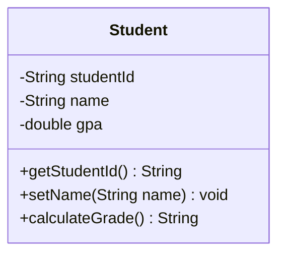
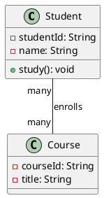

# บทที่ 8: UML Class Diagrams และ Model-Based Coding

## Learning Outcomes (ผลลัพธ์การเรียนรู้)

หลังจากเรียนจบบทนี้ นักศึกษาจะสามารถ:

1. ระบุ (Identify) องค์ประกอบพื้นฐานของ UML Class Diagram เช่น ชื่อคลาส (Class Name), คุณลักษณะ (Attributes) และ เมธอด (Methods) ได้
2. อธิบาย (Describe) ความหมายของระดับการเข้าถึงพื้นฐาน (Public และ Private) รวมถึงสัญลักษณ์ที่ใช้แทนได้
3. วาด (Draw) Class Diagram พื้นฐานเพื่อจำลองวัตถุอย่างง่าย ตามโจทย์ที่กำหนดได้
4. จดจำและแยกแยะ (Recognize) สัญลักษณ์ของความสัมพันธ์หลัก 3 แบบได้แก่ Inheritance, Association และ Composition
5. แปลง (Translate) แผนภาพ Class Diagram อย่างง่าย ให้เป็นโครงสร้างคลาสในภาษา Java (ชื่อคลาสและตัวแปร) ได้ (CLO6)
6. เขียนโค้ดตามแบบที่กำหนด (Follow) โดยใช้ Model ที่กำหนดให้เป็นแนวทางในการสร้างโครงสร้างโปรแกรมเบื้องต้นได้ (CLO6)

## 1. ความหมายของ Class Diagram

**Class Diagram** คือแผนภาพที่แสดง:

* **โครงสร้างของ Classes** ในระบบ
* **Attributes** และ **Methods** ของแต่ละ Class
* **ความสัมพันธ์** (Relationships) ระหว่าง Classes

### ประโยชน์

* **การสื่อสาร**: แสดงโครงสร้างระบบให้เข้าใจง่าย
* **การออกแบบ**: วางแผนก่อนเขียนโค้ด
* **Documentation**: เอกสารประกอบระบบ
* **การวิเคราะห์**: เข้าใจระบบที่มีอยู่

## 2. สัญลักษณ์พื้นฐาน

### 2.1 Class

```
┌─────────────────────┐
│      ClassName      │  ← ชื่อ Class
├─────────────────────┤
│ - attribute1: Type  │  ← Attributes (Fields)
│ + attribute2: Type  │
├─────────────────────┤
│ + method1(): void   │  ← Methods
│ - method2(): Type   │
└─────────────────────┘
```



### 2.2 Access Modifiers

```
+  public      (เข้าถึงได้จากทุกที่)
-  private     (เข้าถึงได้ใน Class เท่านั้น)
#  protected   (เข้าถึงได้จาก Class และ Subclass)
~  default     (เข้าถึงได้ใน Package เดียวกัน)
```

### ตัวอย่าง Class

```
┌─────────────────────────────┐
│         Student             │
├─────────────────────────────┤
│ - studentId: String         │
│ - name: String              │
│ - gpa: double               │
├─────────────────────────────┤
│ + getStudentId(): String    │
│ + setName(name: String)     │
│ + calculateGrade(): String  │
└─────────────────────────────┘
```

**แปลเป็น Java Code:**

```java
public class Student {
    private String studentId;
    private String name;
    private double gpa;
    
    public String getStudentId() {
        return studentId;
    }
    
    public void setName(String name) {
        this.name = name;
    }
    
    public String calculateGrade() {
        // implementation
    }
}
```

## 3. Relationships (ความสัมพันธ์)

### 3.1 Association (ความสัมพันธ์ทั่วไป)

แสดงว่า Class หนึ่ง**ใช้งาน**หรือ**เกี่ยวข้อง**กับ Class อื่น

```
┌─────────┐            ┌─────────┐
│ Student ├────────────┤ Course  │
└─────────┘            └─────────┘
```

**Java Code:**

```java
class Student {
    private Course course;  // Student เกี่ยวข้องกับ Course
}
```

### 3.2 Multiplicity (จำนวนความสัมพันธ์)

```
┌─────────┐      1      ┌─────────┐
│ Teacher ├─────────────┤ Course  │
└─────────┘             └─────────┘

┌─────────┐      *      ┌─────────┐
│ Student ├─────────────┤ Course  │
└─────────┘             └─────────┘

Symbols:
1      = เท่ากับ 1
0..1   = 0 หรือ 1
*      = 0 หรือมากกว่า
1..*   = 1 หรือมากกว่า
5..10  = ระหว่าง 5 ถึง 10
```

**ตัวอย่าง:**

```
┌─────────┐    1     *  ┌─────────┐
│ Teacher ├────────────┤ Student │
└─────────┘  teaches   └─────────┘
```

* 1 Teacher สอนได้หลาย (\*) Students
*
  * Students เรียนกับ 1 Teacher

### 3.3 Inheritance (Generalization)

แสดง **IS-A relationship** (Subclass สืบทอด Superclass)

```
       ┌─────────┐
       │ Animal  │
       └────┬────┘
            │
            △ (ลูกศรสามเหลี่ยม ชี้ไป Superclass)
            │
     ┌──────┴──────┐
     │             │
┌────┴────┐   ┌────┴────┐
│   Dog   │   │   Cat   │
└─────────┘   └─────────┘
```

**Java Code:**

```java
class Animal { }
class Dog extends Animal { }
class Cat extends Animal { }
```

### 3.4 Composition (ความเป็นส่วนหนึ่ง - แข็งแกร่ง)

แสดงว่า Class หนึ่ง**ประกอบด้วย** Class อื่น และ**ไม่สามารถอยู่ได้โดยไม่มี**กัน

```
┌─────────┐  ◆────────  ┌─────────┐
│   Car   │             │ Engine  │
└─────────┘             └─────────┘
```

* **◆ (Filled Diamond)** = Composition
* Engine เป็นส่วนหนึ่งของ Car
* ถ้า Car ถูกทำลาย Engine ก็ถูกทำลายด้วย

**Java Code:**

```java
class Car {
    private Engine engine;  // Car มี Engine
    
    public Car() {
        this.engine = new Engine();  // สร้างพร้อมกัน
    }
}
```

### 3.5 Aggregation (ความเป็นส่วนหนึ่ง - อ่อนแอ)

แสดงว่า Class หนึ่ง**ประกอบด้วย** Class อื่น แต่**สามารถอยู่ได้แยกกัน**

```
┌────────────┐  ◇────────  ┌─────────┐
│ Department │             │ Teacher │
└────────────┘             └─────────┘
```

* **◇ (Empty Diamond)** = Aggregation
* Department มี Teachers
* ถ้า Department ถูกลบ Teachers ยังอยู่ได้

**Java Code:**

```java
class Department {
    private List<Teacher> teachers;  // มี Teachers
    
    public void addTeacher(Teacher teacher) {
        teachers.add(teacher);  // Teacher มีอยู่แล้ว
    }
}
```

## 4. ตัวอย่าง Class Diagram สมบูรณ์

### ระบบห้องสมุด (Library System)

```
                 ┌─────────────────┐
                 │     Person      │
                 ├─────────────────┤
                 │ - name: String  │
                 │ - id: String    │
                 ├─────────────────┤
                 │ + getName()     │
                 │ + setName()     │
                 └────────┬────────┘
                          △
                          │
              ┌───────────┴───────────┐
              │                       │
    ┌─────────┴─────────┐   ┌────────┴────────┐
    │      Member       │   │    Librarian    │
    ├───────────────────┤   ├─────────────────┤
    │ - memberCard: int │   │ - employeeId    │
    ├───────────────────┤   ├─────────────────┤
    │ + borrowBook()    │   │ + addBook()     │
    │ + returnBook()    │   │ + removeBook()  │
    └──────┬────────────┘   └─────────────────┘
           │
           │ * borrows *
           │
    ┌──────┴────────┐
    │     Book      │
    ├───────────────┤
    │ - isbn: String│
    │ - title       │
    │ - author      │
    ├───────────────┤
    │ + getInfo()   │
    └───────────────┘
```

## 5. การแปลงระหว่าง Class Diagram และ Java Code

### จาก Class Diagram เป็น Java Code

**Class Diagram:**

```
┌──────────────────────┐
│      BankAccount     │
├──────────────────────┤
│ - accountNumber: int │
│ - balance: double    │
├──────────────────────┤
│ + deposit(amount)    │
│ + withdraw(amount)   │
│ + getBalance()       │
└──────────────────────┘
```

**Java Code:**

```java
public class BankAccount {
    private int accountNumber;
    private double balance;
    
    public void deposit(double amount) {
        // implementation
    }
    
    public void withdraw(double amount) {
        // implementation
    }
    
    public double getBalance() {
        return balance;
    }
}
```

### จาก Java Code เป็น Class Diagram

**Java Code:**

```java
public class Rectangle {
    private double width;
    private double height;
    
    public double calculateArea() {
        return width * height;
    }
    
    public double calculatePerimeter() {
        return 2 * (width + height);
    }
}
```

**Class Diagram:**

```
┌──────────────────────────────┐
│        Rectangle             │
├──────────────────────────────┤
│ - width: double              │
│ - height: double             │
├──────────────────────────────┤
│ + calculateArea(): double    │
│ + calculatePerimeter(): double│
└──────────────────────────────┘
```

## 6. Model-Based Coding (การเขียนโค้ดตามโมเดล) - CLO6

**Model-Based Coding** คือการพัฒนาซอฟต์แวร์โดยเริ่มจาก**การสร้าง Model (Diagram)** ก่อนแล้วจึงเขียนโค้ดตาม Model นั้น

### 6.1 ขั้นตอนการทำ Model-Based Coding

**1. วิเคราะห์ความต้องการ (Requirements Analysis)**

```
ตัวอย่าง: ระบบห้องสมุด
- ต้องการจัดการหนังสือ
- ต้องการจัดการสมาชิก  
- ต้องการบันทึกการยืม-คืน
```

**2. ระบุ Classes และ Responsibilities**

```
Classes ที่ต้องการ:
- Book (หนังสือ)
- Member (สมาชิก)
- Loan (การยืม)
- Library (ห้องสมุด)
```

**3. สร้าง Class Diagram**

```
┌─────────────┐       1       *  ┌─────────────┐
│   Member    ├──────────────────┤    Loan     │
├─────────────┤                  ├─────────────┤
│ - memberId  │                  │ - loanId    │
│ - name      │                  │ - loanDate  │
├─────────────┤                  │ - dueDate   │
│ + borrow()  │                  ├─────────────┤
└─────────────┘                  │ + return()  │
                                 └──────┬──────┘
                                        │
                                        │ *
                                        │ references
                                        │ 1
                                 ┌──────┴──────┐
                                 │    Book     │
                                 ├─────────────┤
                                 │ - isbn      │
                                 │ - title     │
                                 │ - author    │
                                 ├─────────────┤
                                 │ + getInfo() │
                                 └─────────────┘
```

\*\*4. เขียนโค้ดตาม Diagram **(CLO6)**

```java
// Step 1: สร้าง Classes ตามโครงสร้างใน Diagram
class Member {
    private String memberId;
    private String name;
    
    public Member(String memberId, String name) {
        this.memberId = memberId;
        this.name = name;
    }
    
    public void borrow(Book book) {
        // Implementation
    }
}

class Book {
    private String isbn;
    private String title;
    private String author;
    
    public void getInfo() {
        System.out.println(title + " by " + author);
    }
}

class Loan {
    private String loanId;
    private Member member;    // Relationship
    private Book book;        // Relationship
    private Date loanDate;
    private Date dueDate;
    
    public void returnBook() {
        // Implementation
    }
}
```

### 6.2 ประโยชน์ของ Model-Based Coding

**1. การสื่อสาร (Communication)**

* ทีมเข้าใจโครงสร้างระบบเหมือนกัน
* ง่ายต่อการ Review และ Feedback

**2. การวางแผน (Planning)**

* เห็นภาพรวมก่อนเขียนโค้ด
* ประเมินความซับซ้อนได้

**3. ลดข้อผิดพลาด (Error Reduction)**

* พบปัญหาในการออกแบบก่อนเขียนโค้ด
* แก้ไขได้ง่ายกว่าแก้โค้ด

**4. การบำรุงรักษา (Maintenance)**

* Document ที่ชัดเจน
* เข้าใจโครงสร้างได้เร็ว

### 6.3 ตัวอย่าง: ระบบ E-Commerce

**Requirement:** ระบบขายของออนไลน์ที่มี Customer, Product, และ Order

**Class Diagram:**

```
┌──────────────┐
│   Customer   │
├──────────────┤
│ - customerId │
│ - name       │
│ - email      │
├──────────────┤
│ + placeOrder │
└──────┬───────┘
       │ 1
       │ places
       │ *
┌──────┴───────┐      * contains *  ┌──────────────┐
│    Order     ├───────────────────┤  OrderItem   │
├──────────────┤                   ├──────────────┤
│ - orderId    │                   │ - quantity   │
│ - date       │                   │ - price      │
│ - total      │                   └──────┬───────┘
├──────────────┤                          │ *
│ + addItem()  │                          │ references
│ + calculate()│                          │ 1
└──────────────┘                   ┌──────┴───────┐
                                   │   Product    │
                                   ├──────────────┤
                                   │ - productId  │
                                   │ - name       │
                                   │ - price      │
                                   ├──────────────┤
                                   │ + getInfo()  │
                                   └──────────────┘
```

**การเขียนโค้ดตาม Diagram:**

```java
// 1. อ่าน Diagram และระบุ Classes
//    - Customer, Order, OrderItem, Product

// 2. ระบุ Attributes จาก Diagram
class Customer {
    private String customerId;
    private String name;
    private String email;
    
    // 3. ระบุ Methods จาก Diagram
    public Order placeOrder() {
        return new Order(this);
    }
}

class Product {
    private String productId;
    private String name;
    private double price;
    
    public void getInfo() {
        System.out.println(name + ": " + price);
    }
}

// 4. ระบุ Relationships
class OrderItem {
    private Product product;   // references 1 Product
    private int quantity;
    private double price;
    
    public OrderItem(Product product, int quantity) {
        this.product = product;
        this.quantity = quantity;
        this.price = product.getPrice();
    }
}

class Order {
    private String orderId;
    private Customer customer;      // 1 Customer
    private List<OrderItem> items;  // contains * OrderItems
    private double total;
    
    public void addItem(Product product, int quantity) {
        items.add(new OrderItem(product, quantity));
    }
    
    public void calculateTotal() {
        total = 0;
        for (OrderItem item : items) {
            total += item.getSubtotal();
        }
    }
}
```

### 6.4 Best Practices สำหรับ Model-Based Coding

**1. เริ่มง่ายๆ ก่อน**

* สร้าง Diagram พื้นฐานก่อน
* เพิ่มรายละเอียดทีละน้อย

**2. อัพเดท Diagram เมื่อโค้ดเปลี่ยน**

* Diagram ต้องสอดคล้องกับโค้ด
* ใช้เป็น Living Document

**3. ใช้ Tools ช่วย**

* Draw.io, PlantUML, StarUML
* บาง IDE สามารถ Generate Diagram จากโค้ดได้

**4. Review Diagram ก่อนเขียนโค้ด**

* ขอ Feedback จากทีม
* ตรวจสอบความถูกต้องของ Relationships

## 7. ตัวอย่างการใช้งานจริง

ดูตัวอย่างโค้ด Java ที่สมบูรณ์: [ClassDiagramExample.java](../examples/ClassDiagramExample.java)

### สิ่งที่จะเห็นในตัวอย่าง:

1. **การสร้าง Classes ตาม Class Diagram**
2. **การแสดง Relationships ต่างๆ**
3. **การแปลง Class Diagram เป็น Java Code (Model-Based Coding)**
4. **ตัวอย่างระบบร้านค้าออนไลน์แบบสมบูรณ์**

## 8. เครื่องมือสำหรับสร้าง Class Diagram

### เครื่องมือฟรี

1. **Draw.io (diagrams.net)** - ออนไลน์, ฟรี
2. **PlantUML** - สร้างจาก Text
3. **Lucidchart** - ออนไลน์ (Free tier)
4. **StarUML** - Desktop application
5. **Visual Paradigm Online** - ออนไลน์ (Free edition)

### PlantUML ตัวอย่าง



## 9. Best Practices

### 8.1 ความชัดเจน

* ใช้ชื่อที่สื่อความหมาย
* ไม่แสดงรายละเอียดมากเกินไป

### 8.2 ความสม่ำเสมอ

* ใช้ Naming Convention เดียวกัน
* จัดวาง Layout อย่างเป็นระเบียบ

### 8.3 ระดับของรายละเอียด

* Conceptual: แสดงแค่ชื่อ Class และ Relationships
* Specification: แสดง Attributes และ Methods หลัก
* Implementation: แสดงทุกรายละเอียด

## 10. ข้อควรระวัง

### 9.1 ไม่ควรแสดงทุกอย่าง

* แสดงเฉพาะสิ่งที่สำคัญ
* Getters/Setters อาจไม่ต้องแสดง

### 9.2 อัพเดทให้ตรงกับโค้ด

* Diagram ควรสอดคล้องกับ Implementation
* อัพเดทเมื่อโค้ดเปลี่ยน

### 9.3 ใช้ Relationships ที่ถูกต้อง

* เลือก Relationship ที่เหมาะสม
* ไม่ใช้ Composition เมื่อควรเป็น Association

## 11. สรุป

* **Class Diagram** แสดงโครงสร้าง Classes และความสัมพันธ์
* **สัญลักษณ์พื้นฐาน**: +, -, #, \~ สำหรับ Access Modifiers
* **Relationships**: Association, Inheritance, Composition, Aggregation
* **Multiplicity**: 1, _, 0..1, 1.._ แสดงจำนวนความสัมพันธ์
* **ประโยชน์**: การสื่อสาร, ออกแบบ, Documentation
* สามารถแปลงระหว่าง Class Diagram และ Java Code ได้

## แบบฝึกหัด

1. สร้าง Class Diagram สำหรับระบบโรงพยาบาล:
   * Classes: Patient, Doctor, Appointment, MedicalRecord
   * แสดง Relationships ที่เหมาะสม
   * ระบุ Multiplicity
2. แปลง Class Diagram ที่สร้างเป็น Java Code
3. สร้าง Class Diagram จาก Java Code ที่มีอยู่ในโปรเจกต์ของคุณ
4. อธิบายความแตกต่างระหว่าง Composition และ Aggregation พร้อมยกตัวอย่าง
